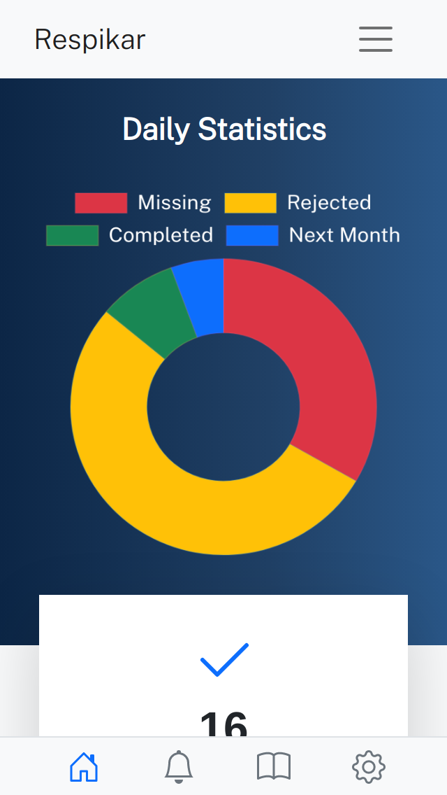
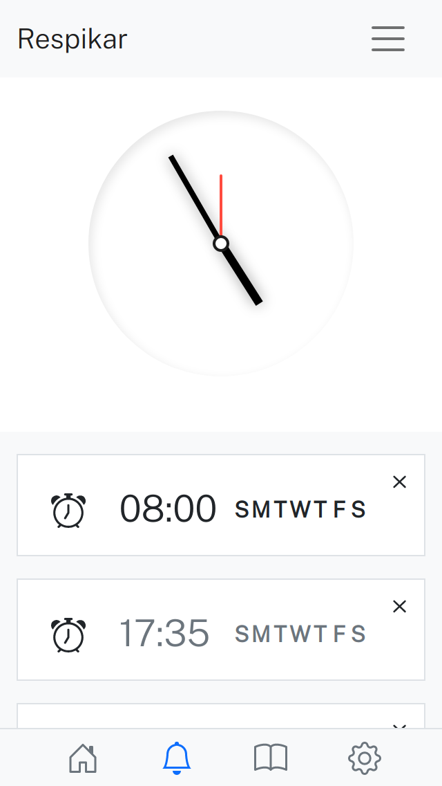
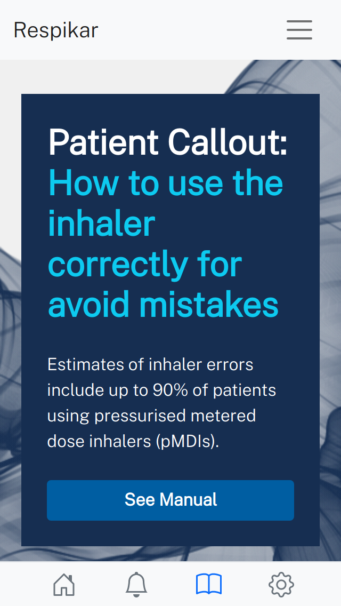
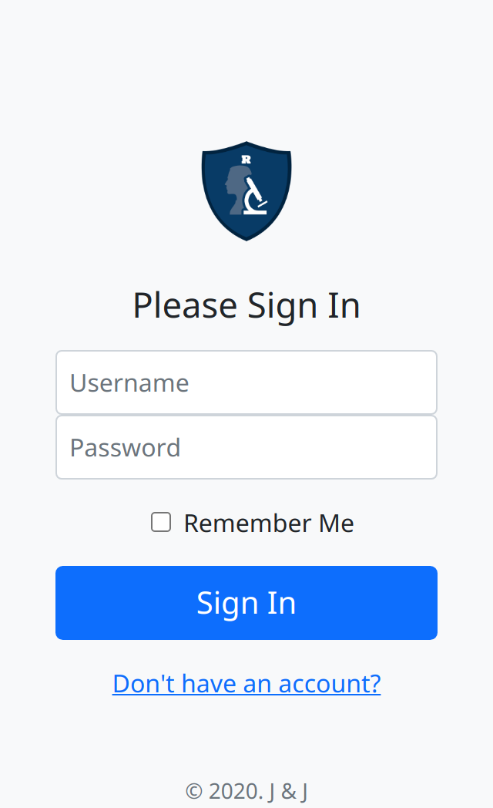
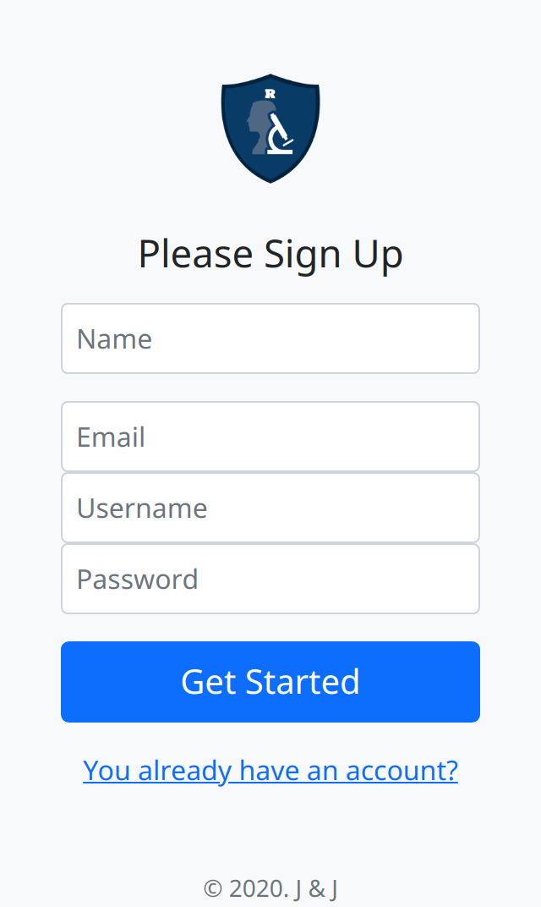

# Respikar.Bootstrap

    
    
    
    
    
    

### References

- <i>How to help patients optimise their inhaler technique</i>
 [The Pharmaceutical Journal](https://www.pharmaceutical-journal.com/PJ,-July-2016,-Vol-297,-No-7891/982.issue)
 27 Jul 2016 By [Anna Murphy](https://www.pharmaceutical-journal.com/anna-murphy/426.bio)
 / <b>Read article</b> [Here](https://www.pharmaceutical-journal.com/cpd-and-learning/learning-article/how-to-help-patients-optimise-their-inhaler-technique/20201442.article?firstPass=false)

 - https://www.creative-tim.com/product/now-ui-dashboard-pro?ref=popper.js.org
