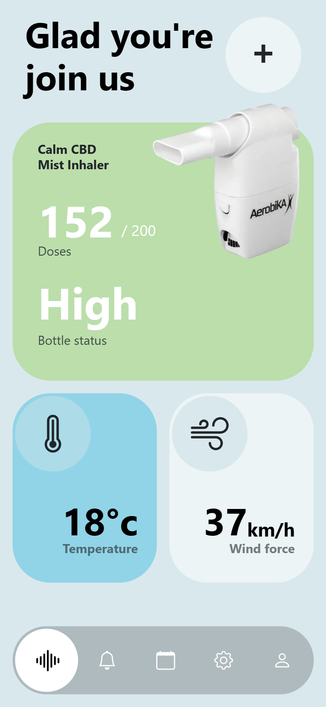

# Respikar.Bootstrap

Application designed to set alarms and display usage statistics of the inhaler by the user, the objectives of the
application are offer better control over the treatment of the respiratory diseases.

### Re-Design

    
    

### Screenshots

    
    
    
    
    

### Tools

### References

<i>How to help patients optimise their inhaler technique</i>
  [The Pharmaceutical Journal](https://www.pharmaceutical-journal.com/PJ,-July-2016,-Vol-297,-No-7891/982.issue)
  27 Jul 2016 By [Anna Murphy](https://www.pharmaceutical-journal.com/anna-murphy/426.bio)
  / <b>Read
  article</b> [Here](https://www.pharmaceutical-journal.com/cpd-and-learning/learning-article/how-to-help-patients-optimise-their-inhaler-technique/20201442.article?firstPass=false)

###### Dribbble - [Jack R. for RonDesignLab](https://dribbble.com/shots/20081510-WellBeings-CBD-Inhaler-App)
